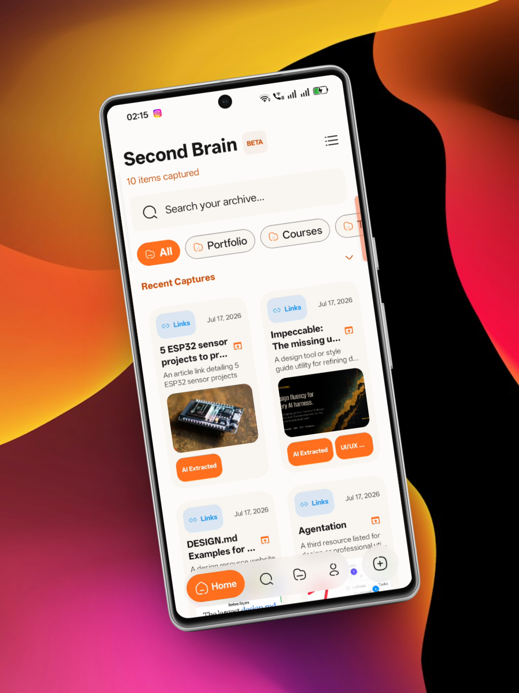
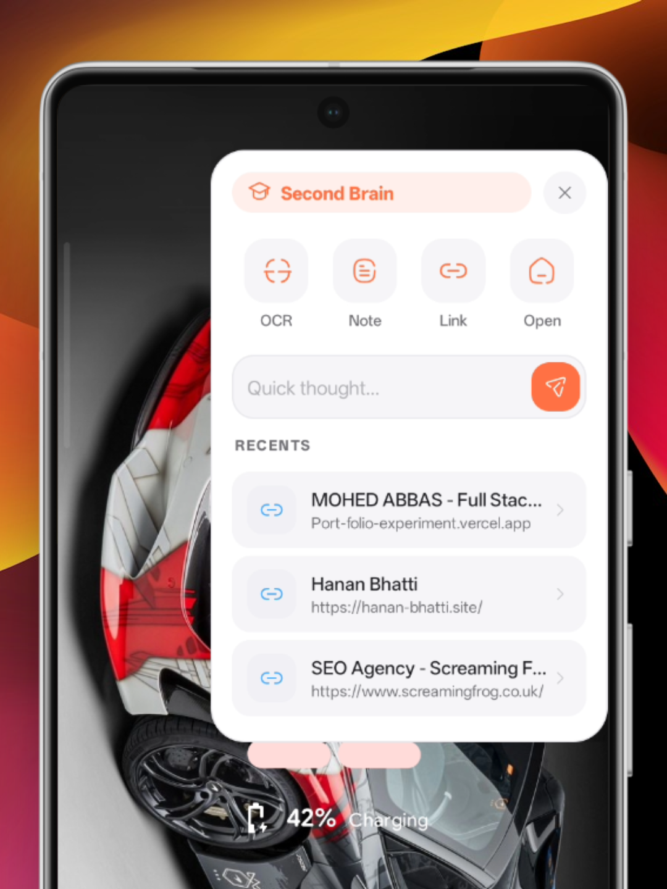
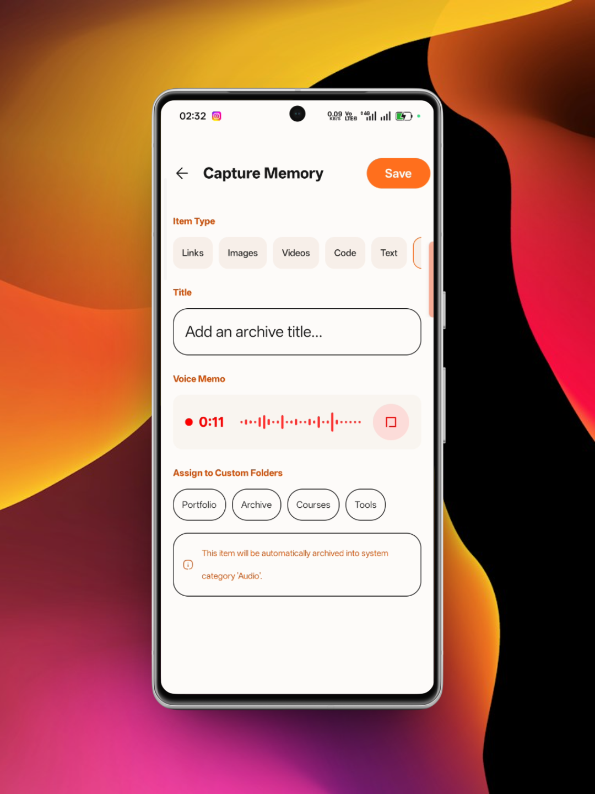

# Second Brain

A universal capture and personal knowledge archive with minimalist design and Gemini AI OCR region marking.

<p align="center">
  
  
  
  
</p>

---

## Overview

**Second Brain** (package: `com.hanan_bhatti.second_brain`) is a minimalist, offline-first personal knowledge archive and universal capture app for Android. Designed to eliminate the friction of digital hoarding and info fragmentation, Second Brain acts as your central repository for ideas, documents, audio clips, snapshots, and shared web content. 

The app features an automated, on-device OCR system driven by Google's Gemini API, allowing you to highlight specific regions of your screen and instantly convert visual information into searchable, structured text notes.

---

## Screenshots

<p align="center">  </p>

> [!NOTE]
> For a full visual walkthrough of all 14 application screens, settings, and custom configurations, please see the [Screenshots Directory Guide](assets/screenshots/README.md).


---

## Key Features

### 📥 Universal & Rapid Capture
*   **System Share Sheet Interceptor:** Ingest plain text, markdown lists, images, video clips, and web URLs directly from any third-party app with Android's native share handler.
*   **Deep Linking Support:** Access specific notes and content folders directly via custom `secondbrain://item/` deep links.
*   **Quick Capture FAB:** A dynamic expanding Floating Action Button allows manual note creation, rapid link bookmarking, and instant media attachments.
*   **Android App Shortcuts:** Launch specific capture workflows directly from your device launcher with dedicated shortcuts (Smart Capture, Create Quick Note).

### 🔍 Floating OCR & Region Capture HUD
*   **Persistent Edge Panel:** A custom-drawn floating handle sits on the edge of your screen, letting you swipe or tap to invoke the capture suite over any active application.
*   **Media Projection Snapping:** Capture background screenshots cleanly using Android's `MediaProjection` API (handles system dialog dismissal delays and orientation changes).
*   **OCR Region Marking:** Tap and drag a bounding box on the captured screen to send specific regions directly to the Gemini API for text extraction.
*   **Fuzzy Link Detection:** Automatically detects shared links inside screenshots and provides a quick review panel to bookmark URLs.

### 🎙️ AI Voice Memos & Formatting
*   **Live Waveform Capture:** Record voice notes with visual status monitoring and local audio cache storage.
*   **Gemini Audio Transcription:** Transcribe complex audio recordings directly into structured text using Gemini AI models.
*   **Automatic Markdown Formatting:** Auto-format transcripts into polished markdown structures with dynamic heading/title extraction.

### 🗂️ Intuitive Organization
*   **Sticker-Themed Folders:** Group your files into custom folders styled with curated Material Design sticker colors.
*   **Drag-to-Reorder Gestures:** Sort and prioritize captured memory cards and custom folders on the fly using intuitive drag-and-drop lists.
*   **Media Categories:** Automated system categorization organizes items by resource type (Links, Images, Videos, Code, Text, Audio).
*   **Archive Feed:** Declutter your primary dashboard by moving items to the Archive folder without permanently deleting them.

### 🔒 Privacy & Cloud Synchronization
*   **Offline-First Cache:** Uses a secure, local Room database as the primary source of truth, ensuring instant launch and data accessibility without network connection.
*   **Firebase Cloud Backups:** Seamlessly backup metadata and media files (images, audio) to Firebase Firestore and Firebase Storage.
*   **Passwordless Email & Google Sign-In:** Authenticate securely using Firebase Email Link Authentication or Google Sign-In with Android's Credential Manager.
*   **Storage Diagnostics:** Monitor storage metrics, compress cached media files, and export/import database backups directly from Settings.

---

## Tech Stack

*   **Framework:** Jetpack Compose (100% Declarative UI)
*   **Architecture:** MVVM (Model-View-ViewModel) with Kotlin Coroutines StateFlow
*   **Database:** SQLite via Android Room Database
*   **Cloud Services:** Firebase Auth, Firebase Firestore, Firebase Storage, and Firebase App Check
*   **AI Integration:** Gemini API via Retrofit and Google client services (`firebase-ai`)
*   **Media Engine:** AndroidX Media3 (ExoPlayer) for high-performance audio playback
*   **Widgets:** Jetpack Glance with Material 3 styling
*   **Visual Style:** Material Design 3, dynamic typography scaling, custom "Superr" theme color palettes, and glassmorphism blur effects using **Haze**.

---

## Permissions

| Permission | Type | Why it's needed |
|---|---|---|
| `android.permission.INTERNET` | Normal | To synchronize data with Firebase services, query the Gemini API, and fetch webpage titles/descriptions. |
| `android.permission.ACCESS_NETWORK_STATE` | Normal | To verify network states and throttle sync jobs to conserve battery when offline. |
| `android.permission.RECORD_AUDIO` | Dangerous | To capture vocal notes and save recording files. |
| `android.permission.SYSTEM_ALERT_WINDOW` | Signature/Special | To display the floating edge handle overlay HUD on top of other running apps. |
| `android.permission.FOREGROUND_SERVICE` | Normal | To allow long-running screen capture and network operations. |
| `android.permission.FOREGROUND_SERVICE_MEDIA_PROJECTION` | Foreground | To project and capture screen contents for region-marked OCR text extraction. |
| `android.permission.FOREGROUND_SERVICE_DATA_SYNC` | Foreground | To process file synchronization and downloads without interruption. |
| `android.permission.FOREGROUND_SERVICE_SPECIAL_USE` | Foreground | To host the floating overlay handle service persistently. |
| `android.permission.POST_NOTIFICATIONS` | Dangerous | To display notifications indicating active screen capture or data sync operations. |
| `android.permission.RECEIVE_BOOT_COMPLETED` | Normal | To re-register widget update broadcasts and start the floating OCR panel handle automatically on device startup. |
| Custom Autostart permissions | OEM Custom | Custom permissions for Oppo, Vivo, and Xiaomi/MIUI to prevent system battery managers from freezing background overlays. |

---

## Installation & Build

### Prerequisites
*   **Java Development Kit (JDK):** Version 21
*   **Minimum SDK:** API Level 24 (Android 7.0)
*   **Target SDK:** API Level 37 (Android 15+)

### Local Setup
1.  **Clone the Repository:**
    ```bash
    git clone https://github.com/hanan-bhatti/second-brain.git
    cd second-brain
    ```
2.  **Configure Firebase:**
    *   Create a Firebase Project in the [Firebase Console](https://console.firebase.google.com/).
    *   Register an Android App under the package name `com.hanan_bhatti.second_brain`.
    *   Download your `google-services.json` file and place it in the `app/` directory.
3.  **Setup Environment Variables:**
    *   Copy the example environment configuration:
        ```bash
        cp .env.example .env
        ```
    *   Open `.env` and configure your API keys (e.g., `GEMINI_API_KEY`).
4.  **Assemble Debug APK:**
    ```bash
    ./gradlew assembleDebug
    ```

---

## License

This project is licensed under the **GNU AGPLv3 (GNU Affero General Public License v3.0)** - see the [LICENSE](LICENSE) file for details.
