# Second Brain — Application Screenshots & Walkthrough

This directory contains high-fidelity visual mockups and screens demonstrating the core user flows, interfaces, and settings of the **Second Brain** Android application.

---

## 📱 Core Application Flows

### 1. Main Dashboard & Home Screen
The central command center of the app. It displays a comprehensive search bar, horizontal scrolling folder categories, and a dual-column grid layout of recently captured links, text notes, documents, and other items.

---

### 2. Floating Edge-Handle Widget (Quick Actions)
A system-wide overlay triggerable from any screen/app. It allows users to write quick thoughts, instantly bookmark links, trigger region-specific OCR extraction, or open the main application without context switching.

---

### 3. OCR Screen Capture & Target Selection
Before triggering on-device OCR, the screen capture service overlays a handle so the user can easily select the target text or area on their device.
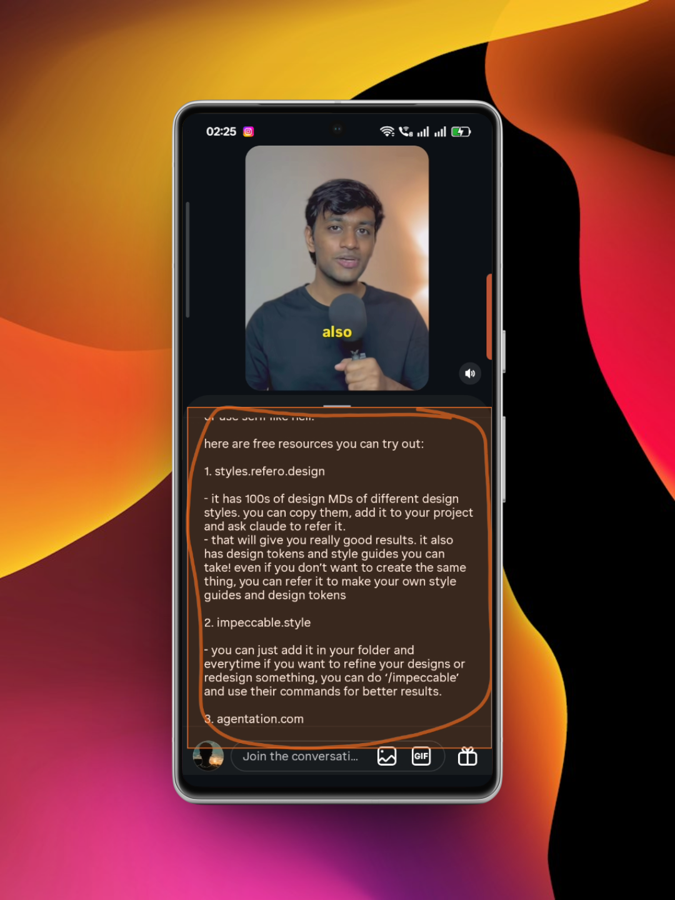

---

### 4. OCR Intelligence Hub (Extracted Links)
After scanning the target screen area, the Gemini-powered OCR identifies all hyperlinks, extracts meta-descriptions, and presents them in a quick-review checklist to be instantly saved into designated folders.
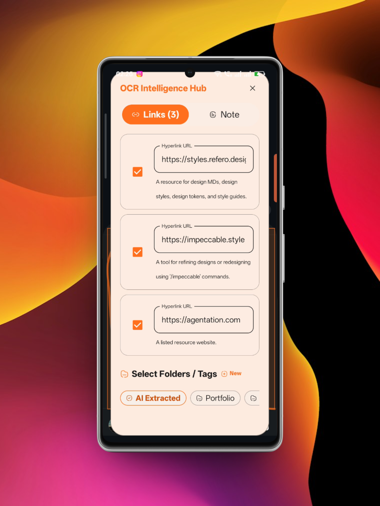

---

### 5. Voice Memo Recording
Minimalist audio recording screen featuring a dynamic red soundwave visualizer, a live timer, folder categorization selectors, and a target folder assignment bar.

---

### 6. Voice Memo Transcription & Markdown Preview
Once recorded, the memo is transcribed locally. The app includes a rich text viewer with a markdown preview tab, displaying the generated text formatted in structured headers and bullet points.
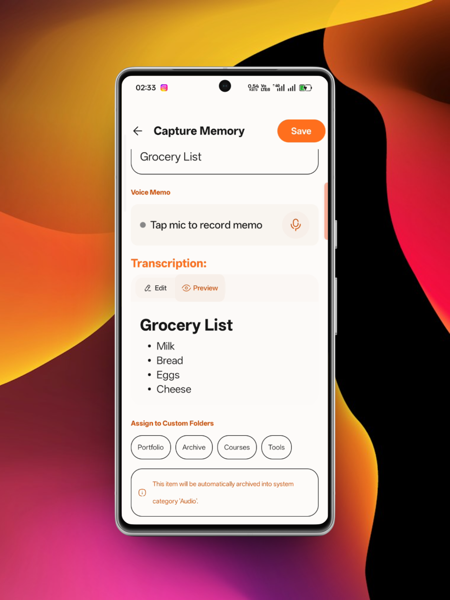

---

### 7. Universal Link Capture
A dedicated modal to capture web URLs manually, enabling rapid title generation, categorization, metadata extraction, and tag assignment.
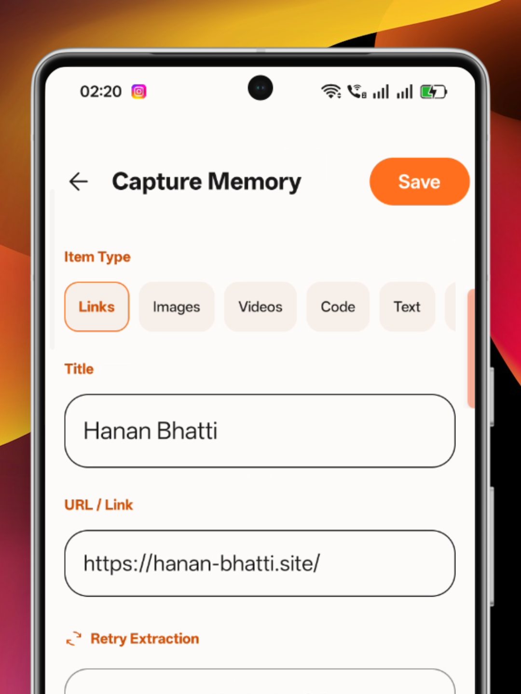

---

### 8. Folders & Categories Manager
The categorization hub showing default directories (Links, Images, Videos, Code, Text, Audio) and custom folders pinned by the user with bespoke colors and icons (such as the *Portfolio* folder).
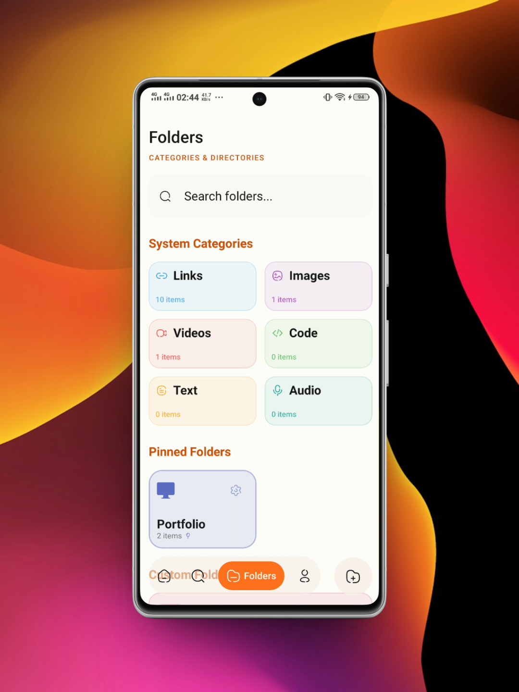

---

### 9. Active Search & Filtering
The search screen showing real-time query results (e.g. searching for "por" returning "Hanan Bhatti Portfolio") with quick filter pills to isolate specific file formats.
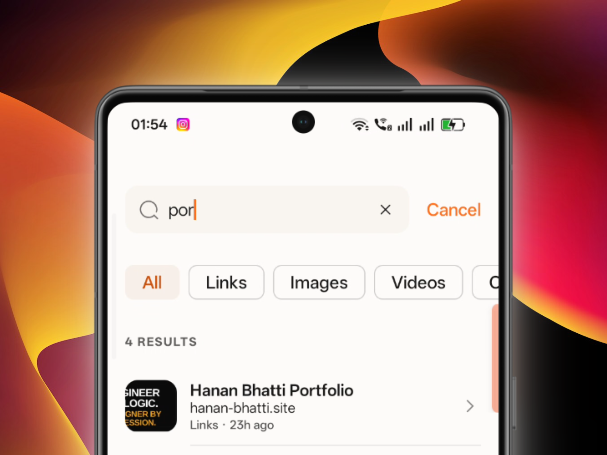

---

### 10. Saved Memory Details
The detail page for any saved memory. It features metadata logs, tags, a screenshot card, a parsed text preview description, and an action button to edit the memory details.
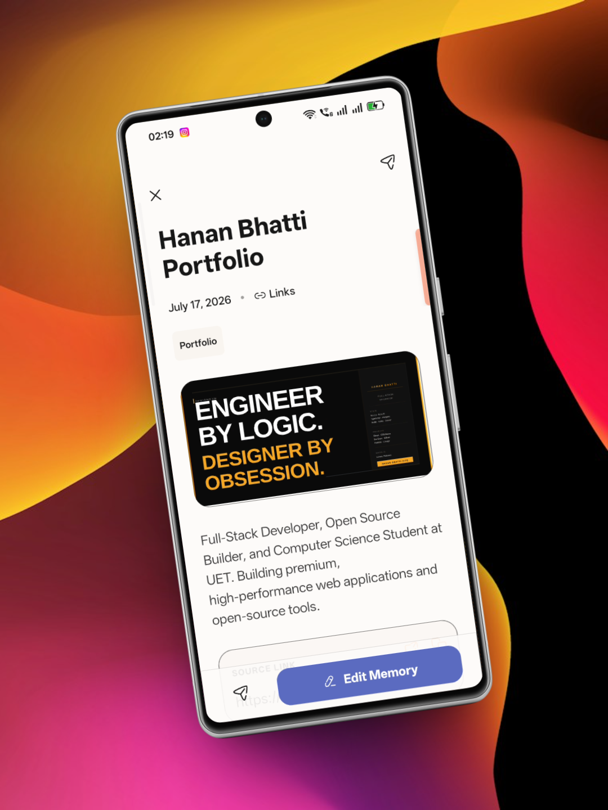

---

### 11. Profile & Archive Statistics
Displays logged-in user profile details, database synchronization status (offline-first sync with Firebase), and a detailed numeric count of items captured across each format.
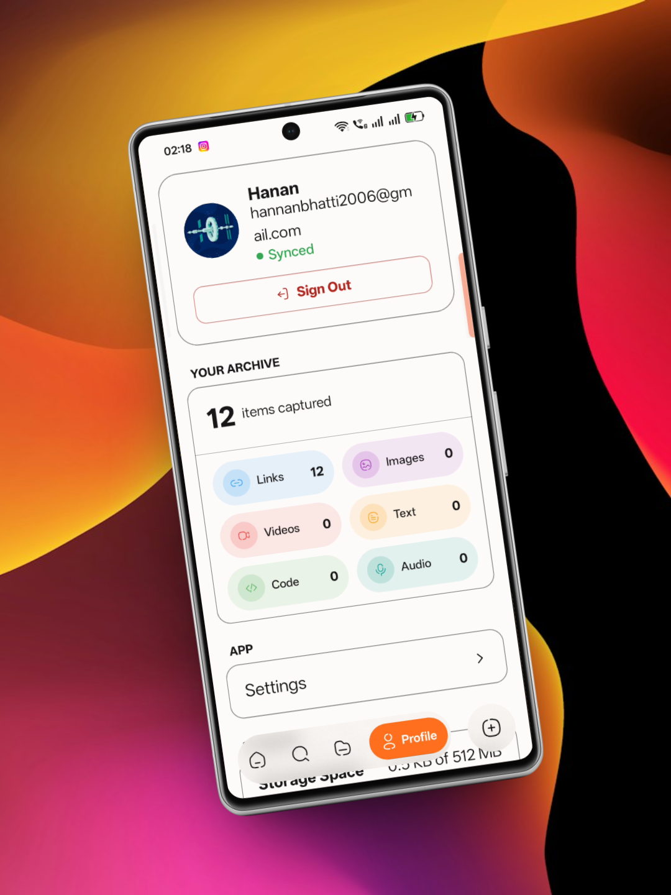

---

### 12. Storage & Cloud Backup Manager
A detailed breakdown of cloud backup utilization showing space occupied by media (e.g. videos and images) against the free 512 MB tier, along with local-vs-cloud synchronization statuses.
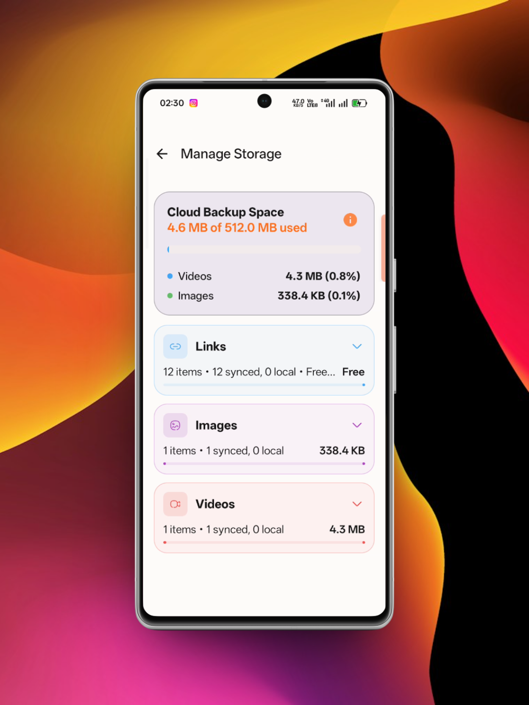

---

### 13. System Settings
The main control panel where users can toggle the app theme, enable/disable the global Floating Edge Panel, configure their on-device Google Gemini API Key, and select target AI models for translation and OCR.
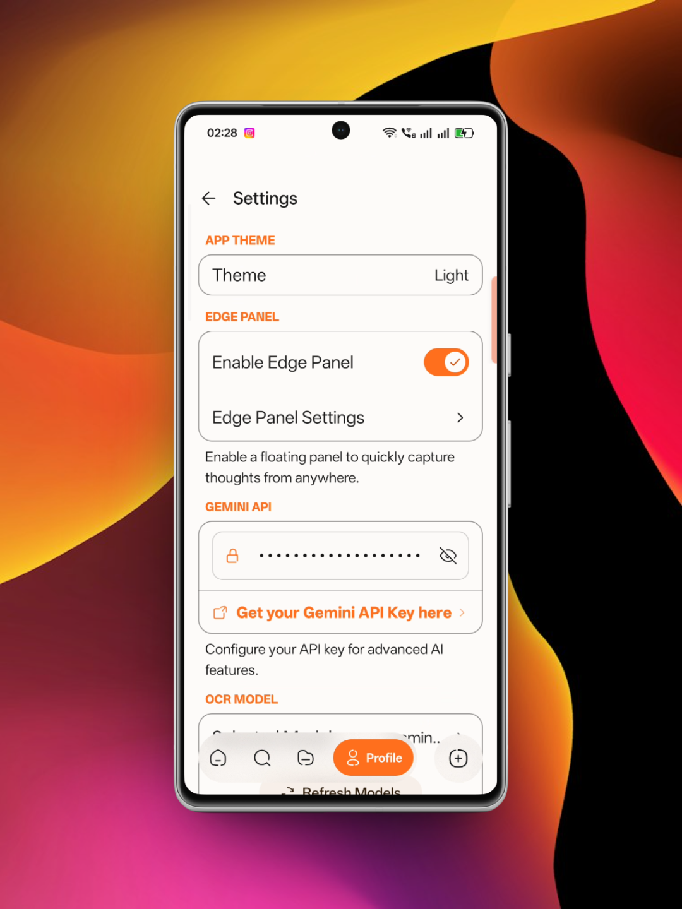

---

### 14. Edge Panel Positions & Alignment
Customization page for the system-wide widget, allowing users to select left/right anchoring and vertical alignment offsets.
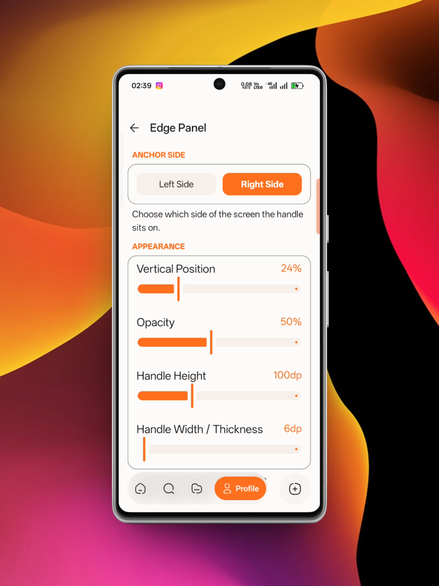
